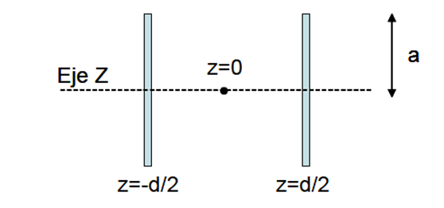
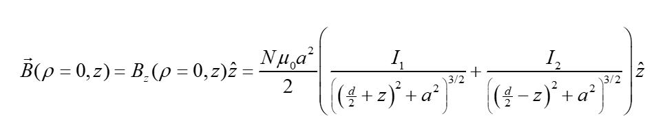
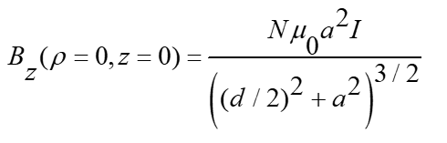
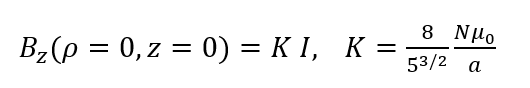

# Carretes de Helmholtz
## 1. Objetivo

El objetivo de esta práctica es el estudio del campo magnético creado por unos carretes de Helmholtz a lo largo de su eje. 

## 2. Material empleado

* Fuente de tensión de corriente continua. 
* Carretes de Helmholtz situados sobre un soporte móvil. 
* Amperímetro. 
* Teslámetro con sonda Hall longitudinal (axial). 
* Regla graduada. 
* Cables de conexión. 

## 3. Fundamento

Supongamos dos bobinas formadas, cada una de ellas por N espiras de radio a separadas por una distancia d, como se muestra en la figura siguiente, siendo I_1 e I_2 las corrientes estacionarias que circulan respectivamente por las bobinas 1 (situada en z=-d/2) y 2 (situada en z=d/2).  

De acuerdo con la ley de Biot y Savart, el valor del campo magnético generado en cualquier punto situado en el eje z (ρ=0), que por simetría no depende de φ, es:

donde z es la distancia medida sobre el eje z tomando como origen el punto central en el eje de los dos carretes y se ha hecho la aproximación de considerar despreciable el espesor de las bobinas.
La expresión anterior para  B ⃗(ρ=0,z) puede particularizarse para los siguientes casos:

1. **Sentido de las corrientes antiparalelo (I_1=-I_2)**
Si z=0 e I_1=-I_2, B_z (z=0)=0. Aprovecharemos este hecho para localizar el punto central en el eje de los carretes, punto que tomaremos como referencia en la medida de longitudes

2. **Si z=0 e I_1=I_2=I**

En particular, si d=a

Este caso es de gran interés ya que es común utilizar esta configuración en experimentos en los que se desea generar un campo magnético uniforme dentro de una región determinada del espacio. Como ejemplo, la figura siguiente muestra una representación gráfica de las líneas de campo magnético para unos carretes en los que se cumple I_1=I_2=I y d=a en la que se observa una zona de campo bastante uniforme.

## 4. Posibles tareas

## 5. Posibles mejoras

## 6. Necesidades y fabricación