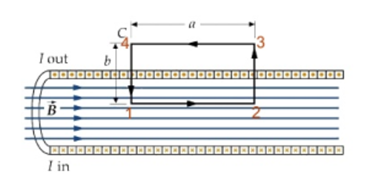
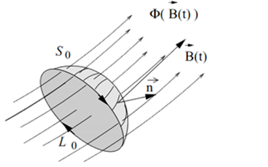

# Carretes de Helmholtz
## 1. Objetivo

El objetivo de esta práctica es entender y comprobar el mecanismo de inducción electromagnética debido a un campo magnético variable con el tiempo. Para ello se estudiará la relación entre el campo magnético creado por una bobina (denominado primario, a través de la corriente que circula por ella) y el voltaje inducido en otra bobina (denominado secundario) situado en su interior. Este voltaje inducido depende de varios parámetros: la frecuencia del campo magnético creado por el primario, la intensidad del campo magnético, y el número de vueltas de las bobinas. Usando este fenómeno se obtendrá una estimación del valor de la permeabilidad magnética del vacío, $\mu_0$.

## 2. Material empleado

* Generador de funciones.
* Solenoide primario.
* Solenoides secundarios, con diferente longitud y número de vueltas.
* Osciloscopio.
* Cables de conexión.

## 3. Fundamento

### 3.1 Campo magnético en el interior de una bobina por la que circula una corriente

Sea una bobina de longitud $L$ y $N$ vueltas ($n=N/L$ es su número de vueltas por unidad de longitud). Si suponemos que la bobina es muy larga comparada con el radio de las espiras que la forman, el campo magnético en su interior es aproximadamente uniforme y paralelo al eje de la bobina, y aproximadamente nulo fuera de esta. Bajo esta aproximación, dada la simetría del problema, podemos calcular el campo $\vec{B}$ usando la ley de Ampere:

$$
\begin{equation}
\oint_C \vec{B}\cdot d\vec{l} = \mu_0 I^*
\tag{1}
\end{equation}
$$

donde el primer miembro, es la circulación del campo magnético a lo largo de un camino cerrado $C$, $I^*$ es la intensidad total que atraviesa una superficie que se apoya en dicho camino y $\mu_0$ es la permeabilidad magnética del vacío.

Para la aplicación de la Ley de Ampere, tomamos el camino rectangular C (de vértices 1, 2, 3, 4) que se muestra en la figura siguiente:

*Fig. 1: Representación de una bobina y del camino empleado para el cálculo del campo.*

A la integral en (1) a lo largo del camino $C$ solamente contribuye el tramo 1-2, ya que en los tramos 2-3 y 4-1 el campo es perpendicular al camino, y en el 3-4, que discurre por el exterior de la bobina, el campo es cero (de acuerdo con la suposición de bobina larga con respecto a su radio). Además, el campo es constante a lo largo del camino 1-2 y paralelo a $d\vec{l}$,  por lo que

$$
\begin{equation}
\oint_C \vec{B}\cdot d\vec{l} = Bl = \mu_0 I^*
\tag{2}
\end{equation}
$$

Dado que hay $N$ espiras en la longitud total $L$ de la bobina, en un tramo de longitud $L$ hay $Nl/L$ espiras. Como cada espira trasporta una corriente de intensidad $I$, la corriente que atraviesa el camino cerrado $C$ es $I^*=NlI/L=nLI$. Sustituyendo el valor de  $I^*$ en (2) se obtiene:

$$
\begin{equation}
bl = \mu_0 I^* = \mu_0nlI
\tag{3}
\end{equation}
$$

donde puede comprobarse que $B$ no depende ni de la longitud de la bobina ni de su diámetro, sino únicamente de la corriente que pasa por las espiras y lo juntas que éstas estén, es decir el número de espiras por unidad de longitud, $N$.

Particularizando (3) para el caso de una intensidad $I(t)$ sinusoidal de la forma $I(t) = I_0 \cos(\omega t)$, se obtiene:

$$
\begin{equation}
B(t) = \mu_0 n I_0 \cos(\omega t)
\tag{4}
\end{equation}
$$

### 3.2 Ley de inducción de Faraday

La ley de inducción de Faraday relaciona la circulación del campo eléctrico a lo largo de un camino con la variación temporal del flujo magnético a través de una superficie que apoya sobre dicho camino. Si el camino está formado por un hilo conductor cerrado se establecerá en él una fuerza electromotriz inducida, $\varepsilon(t)$, que dará lugar a la aparición de una corriente. Es decir, la tensión inducida en un circuito cerrado es directamente proporcional a la rapidez con que cambia el flujo magnético que atraviesa una superficie cualquiera con el circuito como borde. Esta relación puede expresarse de la siguiente forma, usando como elementos de referencia los representados en la figura 2:

$$
\varepsilon(t) = \oint_{L_0} \vec{E}(\vec{r},t)\cdot d\vec{l} = -\frac{d\phi}{dt} = -\frac{d}{dt}\int_{S_{L_0}} \vec{B}(\vec{r},t)\cdot d\vec{S}
\tag{5}
$$

*Fig. 2: Contorno y superficie usados para la integración.*

donde: 
* $\vec{E}$ es el campo eléctrico,
* $L_0$ es un contorno que representa un circuito cerrado,
* $d\vec{l}$ es el elemento infinitesimal de longitud del circuito,
* $\vec{B} $ es el campo magnético,
* y $S_{L_0}$ es una superficie arbitraria, cuyo borde es L_0.

El sentido de $L_0$ y $d\vec{S}$ viene dado por la regla de la mano derecha.

### 3.3 Voltaje inducido en la bobina secundaria

Sabiendo cómo calcular el campo creado en el interior de una bobina, y el voltaje inducido cuando un conductor cerrado es atravesado por un campo magnético variable podemos calcular cómo el campo magnético creado por una bobina induce una tensión en otra bobina en su interior. 

Consideremos que en la bobina descrita en el [apartado anterior](#31-campo-magnético-en-el-interior-de-una-bobina-por-la-que-circula-una-corriente) se introduce una bobina secundaria de $N_S$ espiras y área de cada espira $A_S$.

El voltaje inducido en la bobina secundaria se calcula usando (5). Si por la bobina primaria circula una corriente, se creará un campo magnético en su interior, que será uniforme y longitudinal si esta bobina es suficientemente larga comparada con el radio de sus espiras. Este campo atraviesa las $N_S$ espiras de área $A_S$ de la bobina secundaria. Puesto que el campo creado por el primario no depende de los elementos de superficie del secundario (5) se simplifica a:

$$
\begin{align*}
\varepsilon(t) = & - \frac{d}{dt}\int_{S_{L_0}} \vec{B}(\vec{r},t)\cdot d\vec{S}  \\
               = & - \frac{d\vec{B}(\vec{r},t)}{dt}\int_{S_{L_0}} d\vec{S} \\
               = & - \frac{d\vec{B}(\vec{r},t)}{dt}A_S N_S
\tag{6}
\end{align*}

$$

donde, sustituyendo en (6) el valor del campo dado por (4):

$$
\varepsilon(t) = \mu_0 n A_S N_S I_0 \omega \sin(\omega t)
\tag{7}
$$

Por tanto, la amplitud del voltaje inducido en la bobina secundaria vendrá dada por:

$$
\left| \varepsilon(t) \right| = \mu_0 n A_S N_S I_0 \omega
\tag{8}
$$

La amplitud del voltaje inducido es proporcional a varios parámetros: al número de vueltas de la bobina primaria y secundaria, a la frecuencia del campo magnético y a la intensidad de corriente que crea este campo. También es proporcional a una constante física: la permeabilidad magnética del vacío. 
Midiendo el voltaje en función de alguno de estos parámetros, manteniendo fijos los demás, podemos obtener relaciones lineales a través de las cuales puede extraerse el valor de $\mu_0$. 

## 4. Posibles tareas

Según (8) la permeabilidad depende de varios parámetros que podemos controlar y modificar:

1. La magnitud de la corriente en el primario,
2. la frecuencia de la corriente en el primario,
3. el número de vueltas por unidad de longitud del primario,
4. el número de vueltas en el secundario y
5. el area de la sección del secundario.

*1* y *2* se pueden controlar utilizando un generador de funciones para excitar el primario. *3*, *4* y *5* se pueden controlar fabricando bobinas con longitued, secciones y número de vueltas diferentes. Para cumplir las suposiciones de uniformidad de campo en el primario (ver la [sección 3.1](#31-campo-magnético-en-el-interior-de-una-bobina-por-la-que-circula-una-corriente)), el primario debe ser suficientemente largo. Por una cuestión práctica es más sencillo fabricar un único primario, con la longitud necesaria, y varios secundarios con varias combinaciones de secciones y número de vueltas, que al no tener que ser largos serán más fáciles de fabricar.

### 4.1 Voltaje inducido en el secundario en función de la corriente del primario

Si mantenemos fijo el secundario y variamos la señal de entrada (en intensidad o frecuencia) podemos realizar un ajuste lineal de $\varepsilon$ en función de la intensidad o de la señal. De la pendiente de este ajuste podemos extraer $\mu_0$.

Alternativamente podríamos realizar varias series de medidas variando la intensidad **y** la frecuencia de la señal de entrada, es decir, para cada una de una serie de frecuencias $\omega \in (\omega_{min}, \omega_{max})$, variar la corriente tomando valores es $I_0 \in (I_{min}, I_{max})$, generando una distribución 2D de valores de $\varepsilon$. Existen muchos paquetes en diferentes lenguajes de programación que permiten hacer ajustes de este tipo. Por ejemplo, para Python [scipy](https://docs.scipy.org/doc/scipy/index.html) tiene una función [curve_fit](https://docs.scipy.org/doc/scipy/reference/generated/scipy.optimize.curve_fit.html#scipy.optimize.curve_fit) que permitiría ajustar los valores medidos de $\varepsilon$ a una función como (8), dependiente de la frecuencia y de la intensidad de la corriente en el primario

### 4.2 Voltaje inducido en el secundario en función de las características del secundario

En lugar de variar la señal de entrada, podemos mantener esta fija y variar las características del secundario: número de vueltas y sección. Como en [el apartado anterio](#41-voltaje-inducido-en-el-secundario-en-función-de-la-corriente-del-primario) podemos variar solamente una característica o ambas.

## 5. Posibles mejoras

## 6. Necesidades y fabricación

### Bobinas